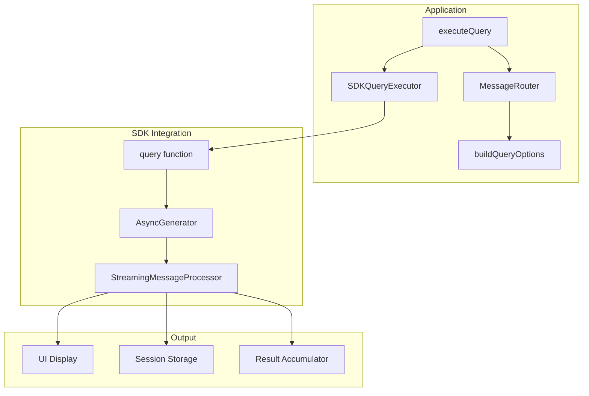
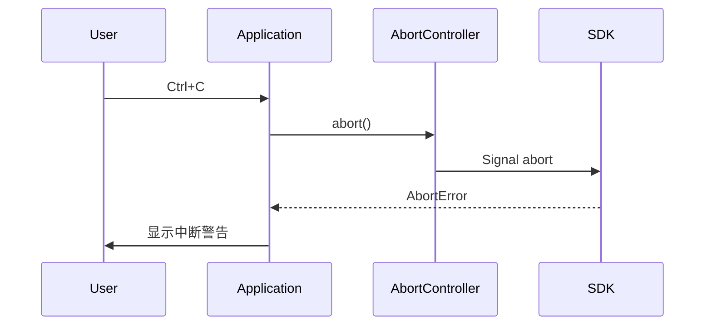

# Design Document: SDK Integration

## Overview

本设计文档描述了将 Claude Replica 项目中的模拟响应实现替换为真实 Claude Agent SDK 调用的技术方案。核心目标是在 `Application.executeQuery()` 方法中集成 `@anthropic-ai/claude-agent-sdk` 包的 `query()` 函数，实现真实的 AI 交互功能。

## Architecture

### 高层架构



### 数据流

1. 用户输入 prompt → `executeQuery()`
2. `MessageRouter.buildQueryOptions()` 构建 SDK 选项
3. `SDKQueryExecutor.execute()` 调用 SDK `query()` 函数
4. SDK 返回 `AsyncGenerator<SDKMessage>`
5. `StreamingMessageProcessor` 处理每个消息
6. 累积响应文本并更新 UI
7. 存储消息到 Session

## Components and Interfaces

### SDKQueryExecutor

新增的核心组件，负责封装 SDK 调用逻辑。

```typescript
import { query, SDKMessage, SDKResultMessage, SDKAssistantMessage } from '@anthropic-ai/claude-agent-sdk';

interface SDKQueryOptions {
  prompt: string;
  model?: string;
  systemPrompt?: string | { type: 'preset'; preset: 'claude_code'; append?: string };
  allowedTools?: string[];
  disallowedTools?: string[];
  cwd?: string;
  permissionMode?: 'default' | 'acceptEdits' | 'bypassPermissions' | 'plan';
  maxTurns?: number;
  maxBudgetUsd?: number;
  maxThinkingTokens?: number;
  mcpServers?: Record<string, McpServerConfig>;
  sandbox?: SandboxSettings;
  abortController?: AbortController;
}

interface SDKQueryResult {
  response: string;
  totalCostUsd?: number;
  durationMs?: number;
  usage?: {
    inputTokens: number;
    outputTokens: number;
  };
  isError: boolean;
  errorMessage?: string;
}

class SDKQueryExecutor {
  private abortController: AbortController | null = null;
  
  async execute(options: SDKQueryOptions): Promise<SDKQueryResult>;
  interrupt(): void;
}
```

### 修改后的 Application.executeQuery()

```typescript
private async executeQuery(
  prompt: string,
  session: Session,
  options?: CLIOptions
): Promise<string> {
  // 1. 添加用户消息到会话
  await this.sessionManager.addMessage(session, {
    role: 'user',
    content: prompt,
  });

  // 2. 构建查询选项
  const queryResult = await this.messageRouter.routeMessage(message, session);
  
  // 3. 创建 AbortController
  const abortController = new AbortController();
  this.currentAbortController = abortController;
  
  // 4. 调用 SDK
  const sdkResult = await this.sdkExecutor.execute({
    prompt: queryResult.prompt,
    ...queryResult.options,
    abortController,
  });
  
  // 5. 处理结果
  if (sdkResult.isError) {
    throw new Error(sdkResult.errorMessage);
  }
  
  // 6. 存储助手响应
  await this.sessionManager.addMessage(session, {
    role: 'assistant',
    content: sdkResult.response,
  });
  
  return sdkResult.response;
}
```

### SDK 消息类型映射

根据 SDK 文档，需要处理以下消息类型：

| SDK 消息类型 | 处理方式 |
|-------------|---------|
| `SDKAssistantMessage` | 提取文本内容，累积到响应 |
| `SDKUserMessage` | 记录到会话历史 |
| `SDKResultMessage (success)` | 返回累积的响应 |
| `SDKResultMessage (error)` | 抛出错误 |
| `SDKSystemMessage` | 记录初始化信息 |
| `SDKPartialAssistantMessage` | 流式更新 UI（可选） |

## Data Models

### SDK 选项映射

从现有 `QueryOptions` 到 SDK `Options` 的映射：

```typescript
// 现有 QueryOptions (MessageRouter)
interface QueryOptions {
  model: string;
  systemPrompt: string;
  allowedTools: string[];
  disallowedTools?: string[];
  cwd: string;
  permissionMode: PermissionMode;
  canUseTool?: CanUseTool;
  mcpServers?: Record<string, McpServerConfig>;
  agents?: Record<string, AgentDefinition>;
  maxTurns?: number;
  maxBudgetUsd?: number;
  maxThinkingTokens?: number;
  sandbox?: SandboxSettings;
}

// SDK Options 映射
function mapToSDKOptions(queryOptions: QueryOptions): SDKOptions {
  return {
    model: queryOptions.model,
    systemPrompt: queryOptions.systemPrompt,
    allowedTools: queryOptions.allowedTools,
    disallowedTools: queryOptions.disallowedTools,
    cwd: queryOptions.cwd,
    permissionMode: queryOptions.permissionMode,
    canUseTool: queryOptions.canUseTool,
    mcpServers: queryOptions.mcpServers,
    agents: queryOptions.agents,
    maxTurns: queryOptions.maxTurns,
    maxBudgetUsd: queryOptions.maxBudgetUsd,
    maxThinkingTokens: queryOptions.maxThinkingTokens,
    sandbox: queryOptions.sandbox,
  };
}
```

### 错误类型定义

```typescript
enum SDKErrorType {
  NETWORK = 'network',
  AUTHENTICATION = 'authentication',
  RATE_LIMIT = 'rate_limit',
  TIMEOUT = 'timeout',
  INTERRUPTED = 'interrupted',
  UNKNOWN = 'unknown',
}

interface SDKError extends Error {
  type: SDKErrorType;
  originalError?: Error;
}
```

## Correctness Properties

*A property is a characteristic or behavior that should hold true across all valid executions of a system-essentially, a formal statement about what the system should do. Properties serve as the bridge between human-readable specifications and machine-verifiable correctness guarantees.*

### Property 1: SDK Options Completeness

*For any* valid QueryOptions object, when mapped to SDK options, all specified fields (model, systemPrompt, allowedTools, cwd, permissionMode, maxTurns, maxBudgetUsd, maxThinkingTokens, sandbox, mcpServers) SHALL be present in the resulting SDK options object with their original values.

**Validates: Requirements 1.2, 6.1, 6.2, 6.3, 6.4, 6.5**

### Property 2: Message Stream Consumption

*For any* SDK query that returns an async generator with N messages, the SDKQueryExecutor SHALL process exactly N messages before returning.

**Validates: Requirements 1.3**

### Property 3: Text Accumulation from Assistant Messages

*For any* sequence of SDKAssistantMessage objects with text content blocks, the accumulated response SHALL equal the concatenation of all text blocks in order.

**Validates: Requirements 2.1**

### Property 4: Success Result Returns Accumulated Response

*For any* SDK query that yields assistant messages followed by a success result, the returned response SHALL contain all accumulated text from assistant messages.

**Validates: Requirements 2.2**

### Property 5: Error Result Throws Exception

*For any* SDK query that yields an SDKResultMessage with error subtype, the SDKQueryExecutor SHALL throw an error containing the error details from the result message.

**Validates: Requirements 2.3**

### Property 6: Session Message Persistence

*For any* successful query execution, the SessionManager SHALL contain both the original user message and the assistant response in the correct order.

**Validates: Requirements 3.1**

### Property 7: Error Type Classification

*For any* SDK error, the Application SHALL classify it into one of the defined error types (network, authentication, rate_limit, timeout, interrupted, unknown) and provide an appropriate user-facing message.

**Validates: Requirements 5.1, 5.2, 5.3**

## Error Handling

### 错误分类与处理策略

```typescript
function classifySDKError(error: Error): SDKErrorType {
  const message = error.message.toLowerCase();
  
  if (message.includes('enotfound') || message.includes('econnrefused') || message.includes('network')) {
    return SDKErrorType.NETWORK;
  }
  
  if (message.includes('401') || message.includes('403') || message.includes('api key') || message.includes('authentication')) {
    return SDKErrorType.AUTHENTICATION;
  }
  
  if (message.includes('429') || message.includes('rate limit')) {
    return SDKErrorType.RATE_LIMIT;
  }
  
  if (message.includes('timeout') || message.includes('timed out')) {
    return SDKErrorType.TIMEOUT;
  }
  
  if (error.name === 'AbortError' || message.includes('aborted')) {
    return SDKErrorType.INTERRUPTED;
  }
  
  return SDKErrorType.UNKNOWN;
}

const ERROR_MESSAGES: Record<SDKErrorType, string> = {
  [SDKErrorType.NETWORK]: '网络错误: 无法连接到服务器，请检查网络连接',
  [SDKErrorType.AUTHENTICATION]: 'API 错误: 认证失败，请检查 ANTHROPIC_API_KEY 环境变量',
  [SDKErrorType.RATE_LIMIT]: '速率限制: 请求过于频繁，请稍后重试',
  [SDKErrorType.TIMEOUT]: '超时错误: 请求超时，请重试',
  [SDKErrorType.INTERRUPTED]: '操作已中断',
  [SDKErrorType.UNKNOWN]: '未知错误',
};
```

### 中断处理流程



## Testing Strategy

### 单元测试

1. **SDKQueryExecutor 测试**
   - 测试选项映射正确性
   - 测试消息流处理
   - 测试错误分类

2. **StreamingMessageProcessor 测试**
   - 测试文本提取
   - 测试工具调用处理
   - 测试结果消息处理

### 属性测试

使用 `fast-check` 库进行属性测试：

1. **Property 1: SDK Options Completeness**
   - 生成随机 QueryOptions
   - 验证所有字段正确映射

2. **Property 2: Message Stream Consumption**
   - 生成随机长度的消息数组
   - 验证所有消息被处理

3. **Property 3: Text Accumulation**
   - 生成随机文本内容的助手消息
   - 验证累积结果正确

4. **Property 6: Session Message Persistence**
   - 执行查询后验证会话包含正确消息

5. **Property 7: Error Type Classification**
   - 生成各种错误消息
   - 验证分类正确

### 集成测试

1. **端到端查询测试**（需要真实 API Key）
   - 测试简单查询
   - 测试多轮对话
   - 测试中断处理

### 测试配置

- 属性测试最少运行 100 次迭代
- 每个属性测试需要标注对应的设计属性编号
- 标签格式: **Feature: sdk-integration, Property {number}: {property_text}**
