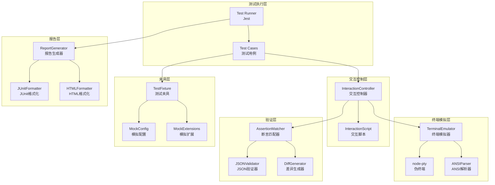

# Design Document: Terminal Interaction Testing

## Overview

本设计文档描述了 Claude Replica 项目的自动化终端交互测试系统架构。该系统使用 Node.js 的 `node-pty` 库创建伪终端会话，模拟真实用户与 CLI 工具的交互，并通过 Jest 测试框架执行和验证测试用例。

系统采用分层架构：
- **终端模拟层**: 负责 PTY 会话管理和输入输出处理
- **交互控制层**: 负责发送命令和等待响应
- **验证层**: 负责输出断言和结果验证
- **夹具层**: 负责测试环境的准备和清理
- **报告层**: 负责生成测试报告

## Architecture



## Components and Interfaces

### 1. TerminalEmulator (终端模拟器)

负责创建和管理 PTY 会话，处理输入输出。

```typescript
interface TerminalEmulatorOptions {
  /** 要执行的命令 */
  command: string;
  /** 命令参数 */
  args?: string[];
  /** 工作目录 */
  cwd?: string;
  /** 环境变量 */
  env?: Record<string, string>;
  /** 终端列数 */
  cols?: number;
  /** 终端行数 */
  rows?: number;
  /** 默认超时时间（毫秒） */
  timeout?: number;
}

interface TerminalEmulator {
  /** 启动终端会话 */
  start(): Promise<void>;
  
  /** 发送输入到终端 */
  write(data: string): void;
  
  /** 发送特殊按键 */
  sendKey(key: SpecialKey): void;
  
  /** 等待输出匹配指定模式 */
  waitFor(pattern: string | RegExp, timeout?: number): Promise<string>;
  
  /** 等待进程退出 */
  waitForExit(timeout?: number): Promise<number>;
  
  /** 获取所有输出 */
  getOutput(): string;
  
  /** 获取去除 ANSI 的输出 */
  getStrippedOutput(): string;
  
  /** 终止进程 */
  kill(signal?: string): void;
  
  /** 清理资源 */
  dispose(): void;
}

/** 特殊按键枚举 */
enum SpecialKey {
  ENTER = 'enter',
  CTRL_C = 'ctrl+c',
  CTRL_D = 'ctrl+d',
  ESCAPE = 'escape',
  TAB = 'tab',
  BACKSPACE = 'backspace',
  UP = 'up',
  DOWN = 'down',
  LEFT = 'left',
  RIGHT = 'right',
}
```

### 2. ANSIParser (ANSI 解析器)

负责解析和处理 ANSI 转义序列。

```typescript
interface ANSIParser {
  /** 去除所有 ANSI 转义序列 */
  strip(text: string): string;
  
  /** 解析 ANSI 序列为结构化数据 */
  parse(text: string): ANSIToken[];
  
  /** 提取纯文本内容 */
  extractText(text: string): string;
}

interface ANSIToken {
  type: 'text' | 'escape';
  content: string;
  style?: ANSIStyle;
}

interface ANSIStyle {
  bold?: boolean;
  italic?: boolean;
  underline?: boolean;
  foreground?: string;
  background?: string;
}
```

### 3. InteractionController (交互控制器)

负责执行交互脚本，协调输入输出。

```typescript
interface InteractionStep {
  /** 步骤类型 */
  type: 'send' | 'sendKey' | 'wait' | 'waitForExit' | 'assert' | 'delay';
  /** 发送的内容或等待的模式 */
  value?: string | RegExp | SpecialKey;
  /** 超时时间 */
  timeout?: number;
  /** 断言选项 */
  assertion?: AssertionOptions;
}

interface InteractionScript {
  /** 脚本名称 */
  name: string;
  /** 脚本描述 */
  description?: string;
  /** 交互步骤 */
  steps: InteractionStep[];
}

interface InteractionController {
  /** 执行交互脚本 */
  execute(script: InteractionScript): Promise<InteractionResult>;
  
  /** 执行单个步骤 */
  executeStep(step: InteractionStep): Promise<StepResult>;
  
  /** 获取当前终端状态 */
  getTerminalState(): TerminalState;
}

interface InteractionResult {
  success: boolean;
  steps: StepResult[];
  totalDuration: number;
  exitCode?: number;
  output: string;
  error?: string;
}

interface StepResult {
  step: InteractionStep;
  success: boolean;
  duration: number;
  output?: string;
  error?: string;
}
```

### 4. AssertionMatcher (断言匹配器)

负责验证输出是否符合预期。

```typescript
interface AssertionOptions {
  /** 匹配类型 */
  type: 'exact' | 'contains' | 'regex' | 'json' | 'jsonSchema';
  /** 预期值 */
  expected: string | RegExp | object;
  /** 是否去除 ANSI */
  stripAnsi?: boolean;
  /** 是否忽略大小写 */
  ignoreCase?: boolean;
  /** 是否忽略空白 */
  ignoreWhitespace?: boolean;
}

interface AssertionResult {
  passed: boolean;
  actual: string;
  expected: string | object;
  diff?: string;
  message?: string;
}

interface AssertionMatcher {
  /** 执行断言 */
  assert(actual: string, options: AssertionOptions): AssertionResult;
  
  /** 精确匹配 */
  exactMatch(actual: string, expected: string): AssertionResult;
  
  /** 包含匹配 */
  containsMatch(actual: string, expected: string): AssertionResult;
  
  /** 正则匹配 */
  regexMatch(actual: string, pattern: RegExp): AssertionResult;
  
  /** JSON 匹配 */
  jsonMatch(actual: string, expected: object): AssertionResult;
  
  /** JSON Schema 验证 */
  jsonSchemaMatch(actual: string, schema: object): AssertionResult;
}
```

### 5. TestFixture (测试夹具)

负责测试环境的准备和清理。

```typescript
interface FixtureOptions {
  /** 是否创建临时目录 */
  createTempDir?: boolean;
  /** 临时目录前缀 */
  tempDirPrefix?: string;
  /** 环境变量 */
  env?: Record<string, string>;
  /** 配置文件 */
  config?: ConfigFixture;
  /** 扩展文件 */
  extensions?: ExtensionFixture;
  /** 模拟设置 */
  mocks?: MockFixture;
}

interface ConfigFixture {
  /** 用户配置 */
  userConfig?: object;
  /** 项目配置 */
  projectConfig?: object;
  /** CLAUDE.md 内容 */
  claudeMd?: string;
}

interface ExtensionFixture {
  /** 技能文件 */
  skills?: SkillDefinition[];
  /** 命令文件 */
  commands?: CommandDefinition[];
  /** 代理文件 */
  agents?: AgentDefinition[];
  /** 钩子配置 */
  hooks?: object;
}

interface MockFixture {
  /** 模拟 API 响应 */
  apiResponses?: MockResponse[];
  /** 模拟文件系统 */
  filesystem?: Record<string, string>;
}

interface TestFixture {
  /** 设置测试环境 */
  setup(): Promise<FixtureContext>;
  
  /** 清理测试环境 */
  teardown(): Promise<void>;
  
  /** 获取临时目录路径 */
  getTempDir(): string;
  
  /** 创建文件 */
  createFile(relativePath: string, content: string): Promise<void>;
  
  /** 读取文件 */
  readFile(relativePath: string): Promise<string>;
  
  /** 设置环境变量 */
  setEnv(key: string, value: string): void;
  
  /** 恢复环境变量 */
  restoreEnv(): void;
}

interface FixtureContext {
  tempDir: string;
  env: Record<string, string>;
  configDir: string;
  sessionsDir: string;
}
```

### 6. ReportGenerator (报告生成器)

负责生成测试报告。

```typescript
interface TestResult {
  name: string;
  suite: string;
  status: 'passed' | 'failed' | 'skipped';
  duration: number;
  error?: string;
  output?: string;
  assertions?: AssertionResult[];
}

interface TestSuiteResult {
  name: string;
  tests: TestResult[];
  duration: number;
  passed: number;
  failed: number;
  skipped: number;
}

interface ReportOptions {
  /** 输出格式 */
  format: 'junit' | 'html' | 'json' | 'console';
  /** 输出路径 */
  outputPath?: string;
  /** 是否包含输出 */
  includeOutput?: boolean;
  /** 是否包含堆栈 */
  includeStack?: boolean;
}

interface ReportGenerator {
  /** 生成报告 */
  generate(results: TestSuiteResult[], options: ReportOptions): Promise<string>;
  
  /** 生成 JUnit XML */
  generateJUnit(results: TestSuiteResult[]): string;
  
  /** 生成 HTML */
  generateHTML(results: TestSuiteResult[]): string;
  
  /** 生成 JSON */
  generateJSON(results: TestSuiteResult[]): string;
  
  /** 输出到控制台 */
  printConsole(results: TestSuiteResult[]): void;
}
```

## Data Models

### 测试配置模型

```typescript
interface TerminalTestConfig {
  /** 全局超时时间 */
  globalTimeout: number;
  /** 默认终端大小 */
  defaultTerminalSize: {
    cols: number;
    rows: number;
  };
  /** CLI 命令路径 */
  cliCommand: string;
  /** 默认环境变量 */
  defaultEnv: Record<string, string>;
  /** 报告配置 */
  reporting: {
    formats: ('junit' | 'html' | 'json' | 'console')[];
    outputDir: string;
  };
  /** 并行配置 */
  parallel: {
    enabled: boolean;
    maxWorkers: number;
  };
}
```

### 测试用例模型

```typescript
interface TerminalTestCase {
  /** 测试名称 */
  name: string;
  /** 测试描述 */
  description?: string;
  /** 测试分类 */
  category: TestCategory;
  /** 夹具配置 */
  fixture?: FixtureOptions;
  /** CLI 参数 */
  cliArgs?: string[];
  /** 交互脚本 */
  script: InteractionScript;
  /** 预期退出码 */
  expectedExitCode?: number;
  /** 超时时间 */
  timeout?: number;
  /** 是否跳过 */
  skip?: boolean;
  /** 仅运行此测试 */
  only?: boolean;
}

enum TestCategory {
  INTERACTIVE = 'interactive',
  NON_INTERACTIVE = 'non-interactive',
  SESSION = 'session',
  EXTENSION = 'extension',
  ERROR = 'error',
  CI = 'ci',
}
```

## Correctness Properties

*A property is a characteristic or behavior that should hold true across all valid executions of a system-essentially, a formal statement about what the system should do. Properties serve as the bridge between human-readable specifications and machine-verifiable correctness guarantees.*

### Property 1: PTY Session Lifecycle

*For any* TerminalEmulator instance, after calling `start()`, the PTY session should be active and the process should be running; after calling `dispose()`, all resources should be released.

**Validates: Requirements 1.1**

### Property 2: Input/Output Round-Trip

*For any* input string sent to TerminalEmulator via `write()`, the CLI process should receive that exact input (verified by echo or response).

**Validates: Requirements 1.2, 1.3**

### Property 3: ANSI Escape Sequence Parsing

*For any* string containing ANSI escape sequences, `ANSIParser.strip()` should return a string with all escape sequences removed, and the remaining text should be preserved exactly.

**Validates: Requirements 1.4**

### Property 4: Timeout Enforcement

*For any* operation with a specified timeout, if the operation exceeds the timeout duration, it should be terminated and a timeout error should be raised.

**Validates: Requirements 1.5, 3.4**

### Property 5: Special Key Encoding

*For any* SpecialKey value, `sendKey()` should produce the correct byte sequence that the terminal interprets as that key.

**Validates: Requirements 1.6**

### Property 6: Multi-Turn Conversation State

*For any* sequence of user inputs in an interactive session, the session should maintain context across turns, and later inputs can reference earlier conversation content.

**Validates: Requirements 2.2, 2.6**

### Property 7: JSON Output Validity

*For any* query executed with `--output-format json`, the output should be parseable as valid JSON.

**Validates: Requirements 3.2**

### Property 8: Stream-JSON Line Validity

*For any* query executed with `--output-format stream-json`, each non-empty line of output should be parseable as valid JSON.

**Validates: Requirements 3.3**

### Property 9: Exit Code Correctness

*For any* CLI execution, the exit code should be 0 for success, and match the appropriate error code (1-5) for different failure types.

**Validates: Requirements 3.5, 3.6, 8.1, 8.2, 8.3, 8.4, 8.5**

### Property 10: Assertion Matching Correctness

*For any* actual string and expected pattern, `AssertionMatcher.assert()` should return `passed: true` if and only if the actual string matches the expected pattern according to the specified match type.

**Validates: Requirements 4.1, 4.2, 4.4**

### Property 11: JSON Schema Validation

*For any* JSON string and JSON Schema, `jsonSchemaMatch()` should return `passed: true` if and only if the JSON conforms to the schema.

**Validates: Requirements 4.3**

### Property 12: ANSI Comparison Modes

*For any* string with ANSI codes, when `stripAnsi: true`, the assertion should compare stripped versions; when `stripAnsi: false`, it should compare raw versions.

**Validates: Requirements 4.5**

### Property 13: Fixture Lifecycle

*For any* TestFixture, after `setup()` the temp directory should exist and be writable; after `teardown()` the temp directory should be removed.

**Validates: Requirements 5.1, 5.4**

### Property 14: Fixture File Creation

*For any* file specification in FixtureOptions, the corresponding file should be created with the exact content specified.

**Validates: Requirements 5.2, 5.3, 5.5**

### Property 15: Session Persistence Round-Trip

*For any* session created during a test, the session file should exist on disk, and loading that session should restore the same conversation history.

**Validates: Requirements 6.1, 6.3, 6.4**

### Property 16: Non-Existent Session Error

*For any* session ID that does not exist, attempting to resume it should result in an appropriate error.

**Validates: Requirements 6.5**

### Property 17: Extension Loading

*For any* valid extension file (skill, command, agent), the CLI should load it without error and make it available for use.

**Validates: Requirements 7.1, 7.2, 7.3, 7.4**

### Property 18: Extension Error Handling

*For any* malformed extension file, the CLI should handle the error gracefully without crashing.

**Validates: Requirements 7.5**

### Property 19: CI Mode Detection

*For any* CI environment variable (GITHUB_ACTIONS, GITLAB_CI, JENKINS_URL, CI), when set, the CLI should detect CI mode and adjust behavior accordingly.

**Validates: Requirements 9.1, 9.2, 9.3**

### Property 20: Parallel Test Isolation

*For any* two tests running in parallel, they should not interfere with each other's temp directories, environment variables, or session data.

**Validates: Requirements 9.5**

### Property 21: Report Format Validity

*For any* test results, the generated JUnit XML should be valid XML conforming to JUnit schema, and HTML should be valid HTML.

**Validates: Requirements 10.4, 10.5**

### Property 22: Report Timing Accuracy

*For any* test execution, the reported duration should be within 10% of the actual execution time.

**Validates: Requirements 10.2**

## Error Handling

### 错误类型

```typescript
enum TerminalTestErrorType {
  /** PTY 创建失败 */
  PTY_CREATE_FAILED = 'PTY_CREATE_FAILED',
  /** 进程启动失败 */
  PROCESS_START_FAILED = 'PROCESS_START_FAILED',
  /** 超时错误 */
  TIMEOUT = 'TIMEOUT',
  /** 断言失败 */
  ASSERTION_FAILED = 'ASSERTION_FAILED',
  /** 夹具设置失败 */
  FIXTURE_SETUP_FAILED = 'FIXTURE_SETUP_FAILED',
  /** 夹具清理失败 */
  FIXTURE_TEARDOWN_FAILED = 'FIXTURE_TEARDOWN_FAILED',
  /** 脚本执行错误 */
  SCRIPT_EXECUTION_ERROR = 'SCRIPT_EXECUTION_ERROR',
  /** 无效配置 */
  INVALID_CONFIG = 'INVALID_CONFIG',
}

class TerminalTestError extends Error {
  constructor(
    public type: TerminalTestErrorType,
    message: string,
    public cause?: Error
  ) {
    super(message);
    this.name = 'TerminalTestError';
  }
}
```

### 错误处理策略

1. **PTY 错误**: 记录详细错误信息，尝试清理资源，标记测试失败
2. **超时错误**: 终止进程，捕获当前输出，生成超时报告
3. **断言失败**: 生成详细差异报告，继续执行后续断言
4. **夹具错误**: 尝试回滚已创建的资源，标记测试为错误状态

## Testing Strategy

### 单元测试

- **ANSIParser**: 测试各种 ANSI 序列的解析和去除
- **AssertionMatcher**: 测试各种匹配类型的正确性
- **TestFixture**: 测试文件创建和清理
- **ReportGenerator**: 测试各种格式的输出

### 属性测试

使用 `fast-check` 库进行属性测试：

1. **ANSI 解析属性测试**: 生成随机 ANSI 字符串，验证 strip 后不包含转义序列
2. **断言匹配属性测试**: 生成随机字符串对，验证匹配逻辑正确性
3. **JSON 验证属性测试**: 生成随机 JSON，验证 schema 验证正确性
4. **夹具生命周期属性测试**: 验证 setup/teardown 的幂等性

### 集成测试

- 完整的交互式会话测试
- 非交互式模式测试
- 会话恢复测试
- 扩展系统测试
- 错误场景测试

### 测试配置

```typescript
// jest.config.js 扩展
module.exports = {
  // ... 现有配置
  testMatch: [
    '**/tests/**/*.test.ts',
    '**/tests/terminal/**/*.test.ts',
  ],
  testTimeout: 30000, // 终端测试需要更长超时
  maxWorkers: 4, // 限制并行数以避免资源竞争
};
```
